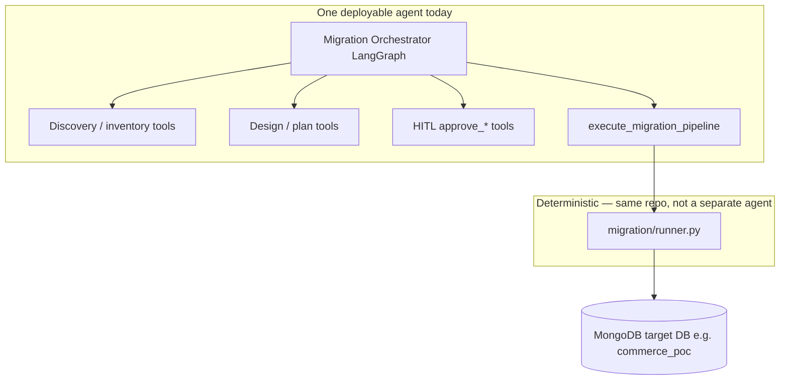
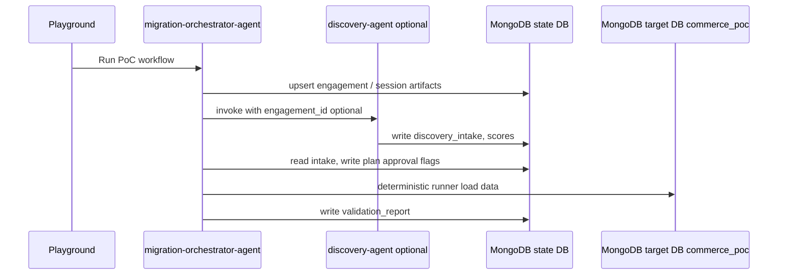

# Migration PoC Generator — architecture

This document describes how **logical specialists**, **deployable agents**, and **state** fit together in hackathon26.

---

## Demo vs production

| | **Demo mode** (this repo) | **Production** (reference) |
|--|---------------------------|----------------------------|
| **Goal** | One Playground, &lt;10 min live demo | Separate intake vs build deployables, shared Mongo state |
| **Physical agents** | **`agents/rdbms-migration-poc-agent/`** only | **`migration-intake-agent`** + **`migration-build-agent`** (or orchestrator + workers) |
| **Specialists** | Six roles via **tools** on one orchestrator | Same roles split across agents + [`packages/migration-core/`](../packages/migration-core/) |
| **Handoff** | Single LangGraph session / platform `session_id` | **`engagement_id`** in state DB — see [`PRODUCTION_MULTI_AGENT.md`](PRODUCTION_MULTI_AGENT.md) |
| **Run locally** | `cd agents/rdbms-migration-poc-agent && agentic dev up` | Not checked in; implement from prod doc when needed |

Do **not** add extra folders under `agents/` for each logical specialist — use tools, prompts, or LangGraph **subgraphs** inside the demo agent instead.

---

## Goals

1. Turn discovery + DDL into a **PoC pack** (intake, inventory, design, plan, load, validation).
2. Keep **migration execution deterministic** (no LLM-generated ETL in production demos).
3. Preserve **human-in-the-loop** at discovery, schema, and execution gates.
4. Document **production multi-agent** without complicating the **single-agent demo**.

---

## Logical vs physical agents

| Layer | What it is | hackathon26 today |
|-------|------------|-------------------|
| **Logical specialists** | Discovery Extractor, Source Modeler, Target Designer, Pipeline Architect, PoC Builder, Validation Planner | Implemented as **tools** + prompts on one **Migration Orchestrator** LangGraph app |
| **Physical agent** | One `agent.yaml`, one `agentic dev up`, one Playground product | **`agents/rdbms-migration-poc-agent/`** (demo) |
| **Deterministic engine** | Postgres → Mongo runner, DDL parser, validation | Python package under `src/.../migration/` (not an LLM agent) |

The MVP proposal shows six specialists for **clarity of responsibilities**. That does **not** require six separate deployable agents. The orchestrator delegates to **tools**; the runner executes from **`migration-plan.json`**.



---

## Repository layout

```text
hackathon26/
  agents/rdbms-migration-poc-agent/   # demo — orchestrator + tools + inline migration/
  packages/migration-core/            # prod reference — runner, workspace, HITL (engagement_id)
  docs/PRODUCTION_MULTI_AGENT.md      # two-agent prod layout (not in agents/)
```

### One repo, many agents (when to add a folder)

Add **`agents/<new-agent-name>/`** when **all** of these are true:

- Separate **Playground entry** or team ownership.
- Different **sandbox / secrets / network** policy in `agent.yaml`.
- You accept **explicit handoff** of state (MongoDB documents, messages, or platform session APIs).

**Do not** add a new folder for each logical specialist in the proposal — use tools, subgraphs, or skills inside one agent instead.

### Shared code across agents

Prefer a **shared library** before duplicating runners:

```text
# Future option (not required for MVP)
packages/migration-core/          # ddl_parser, runner, discovery scorer
agents/rdbms-migration-poc-agent/ # depends on migration-core
agents/migration-orchestrator/    # thin wrapper if split later
```

Demo code lives in `agents/rdbms-migration-poc-agent/src/agent_rdbms_migration_poc/migration/`. When changing the runner or workspace, mirror important fixes in **`packages/migration-core/`** for production agents described in [`PRODUCTION_MULTI_AGENT.md`](PRODUCTION_MULTI_AGENT.md).

---

## Production multi-agent (reference only)

Intake vs **build-and-run** is the recommended production split when you need separate Playgrounds or sandboxes. Full tool lists, handoff (`engagement_id`), env vars, and Docker vendoring notes:

**[`PRODUCTION_MULTI_AGENT.md`](PRODUCTION_MULTI_AGENT.md)**

The hackathon repo does **not** include `agents/migration-intake-agent/` or `agents/migration-build-agent/` — those names describe a target deployment, not local demo layout.

---

## Multi-agent evolution (recommended pattern)

If you split later, use **one orchestrator agent** plus **optional specialist agents** that read/write the **same MongoDB state database** — not six independent Playground sessions for one customer PoC.



**Handoff contract:** documents keyed by `engagement_id` (or platform `session_id`) in a dedicated **state database**, separate from the **customer PoC data database**.

| Document (example) | Purpose |
|--------------------|---------|
| `discovery_intake` | Structured transcript extraction + completeness |
| `source_inventory` | DDL parse + row counts + risk flags |
| `target_schema_design` | Collections, embed decisions |
| `migration_plan` | Runner input JSON |
| `hitl_*` | Approval decisions |
| `validation_report` | Reconciliation output |

---

## State management today

| Concern | Mechanism | Location |
|---------|-----------|----------|
| **PoC pack artifacts (session)** | MongoDB when `MIGRATION_STATE_MONGODB_URI` is set; else file `.mws` | Mutable workspace in `migration_workspace`; immutable ordered pack in `migration_poc_artifacts` |
| **LangGraph thread / HITL resume** | Platform checkpointer (AER + OE) | Managed by Agentic Platform when running `agentic dev up` |
| **Platform memory (STM/LTM)** | `project-config.yaml` | Project-level; agent has `memory: false` in `agent.yaml` today |
| **Migration target data** | `run_migration()` via PyMongo | Database name `MIGRATION_TARGET_DB` (default `commerce_poc`) on cluster **`MONGODB_URI`** |

File workspace works for **one agent** and **one dev machine**. It does **not** share cleanly across **multiple agent processes** or hosts — that is the main reason to move PoC pack artifacts to MongoDB.

### Immutable PoC-pack artifacts

When state MongoDB is configured, `workspace.py` appends each reviewed output to
`migration_poc_artifacts`. Records are scoped to the platform `session_id` and include a
monotonic `sequence`, UTC `created_at`, stable record `_id`, and `content_sha256`. The
payload types are emitted in workflow order: `discovery_assessment`, `source_inventory`,
`hitl_discovery`, `target_schema_design`, `hitl_schema`, `field_mapping`, `migration_plan`,
`hitl_execution`, `migration_execution`, and `validation_report`. This is the traceable
handoff/reuse contract; the mutable
`migration_workspace` document remains the current-session working state.

Use `get_poc_pack_review` in Playground for a Markdown review, or `get_poc_pack_artifacts`
for raw reusable JSON. Reviews are session-scoped: `list_persisted_poc_packs` lists recent
Atlas-backed sessions, and either retrieval tool accepts a selected session ID. File-backed
local runs retain only the active session's records in its `.mws` file.

---

## MongoDB: where connection strings go

**Never commit connection strings.** Use local env files and platform secret injection only.

### Primary location (you edit this)

```text
agents/rdbms-migration-poc-agent/.env
```

Create from `env.example`:

```bash
cd agents/rdbms-migration-poc-agent
cp env.example .env
```

`agentic dev up` loads this agent’s `.env` into the **agent** and **tool** sandboxes (see `agent.yaml` → `sandboxes.*.secrets: ["*"]`).

### Two MongoDB roles (recommended split)

Use **two logical uses** on one Atlas cluster (different databases) or two URIs if policies differ:

| Variable | Purpose | Used by |
|----------|---------|---------|
| **`MONGODB_URI`** | **Migration target** — where the deterministic runner loads PoC **customer-shaped data** (`customers`, `orders`, …) | `migration/runner.py`, `execute_migration_pipeline` |
| **`MIGRATION_STATE_MONGODB_URI`** | **Shared PoC pack / multi-agent state** — artifacts, HITL flags, engagement documents | `workspace.py` when set; `migration_workspace` plus append-only `migration_poc_artifacts` in `MIGRATION_STATE_DB` |
| **`MIGRATION_STATE_DB`** | Database name for state collections (default `migration_poc_state`) | `workspace.py` |
| **`MIGRATION_TARGET_DB`** | Target database name for loaded commerce data (e.g. `commerce_poc`) | Runner |

If `MIGRATION_STATE_MONGODB_URI` is unset, artifacts use **files** under `MIGRATION_WORKSPACE_DIR`. When set, **only state** uses that URI — keep **`MIGRATION_TARGET_DB`** separate so the runner does not mix PoC metadata with loaded `commerce_poc` collections.

### Local `agentic dev`

The dev stack usually provides a **local MongoDB** (Atlas Local in Docker). The platform often writes **`MONGODB_URI`** into generated files under **`.agentic/`** (gitignored), for example:

- `.agentic/aer.env`
- `.agentic/tool-boot.env`

Treat those as **generated**: prefer setting values in **`.env`** (or the Agentic UI env panel) so they survive restarts consistently. After changing `.env`, restart:

```bash
agentic dev down && agentic dev up
```

### Headless CLI on the host

When running **`uv run migration-run`** on your laptop (not inside Docker), use a URI that reaches Mongo from the **host**, e.g. the published port from `docker ps` for `mongodb-1`, not `mongodb://mongodb:27017`.

### Atlas production / field demo

Put the Atlas connection string in **`.env`** only (or your org’s secret store for deployed AER). Scope:

- User with read/write on **`MIGRATION_TARGET_DB`** for migration.
- Separate user or DB for **state** if specialists run in different sandboxes.

### What `project-config.yaml` is not

Root **`project-config.yaml`** configures **platform memory extraction** (Voyage, episodic/semantic extraction). It is **not** where you put **`MONGODB_URI`** for the migration runner or for custom cross-agent artifact stores.

---

## Multi-agent + MongoDB state — implementation checklist

When you implement MongoDB workspace (done in `workspace.py` when `MIGRATION_STATE_MONGODB_URI` is set):

1. Define **`engagement_id`** / map from platform **`session_id`**.
2. ~~Implement **`workspace.py`** backend~~ — file fallback when URI unset; MongoDB otherwise.
3. Set **`MIGRATION_STATE_MONGODB_URI`** + **`MIGRATION_STATE_DB`** in **`.env`**; restart `agentic dev up`.
4. Keep **`execute_migration_pipeline`** on **`MONGODB_URI`** + **`MIGRATION_TARGET_DB`** only.
5. For **demo**, keep one Playground; optional **`MIGRATION_STATE_MONGODB_URI`** still works with platform `session_id` (no `engagement_id` required).
6. Add integration tests with ephemeral Mongo or testcontainers (CI).

---

## HITL and durability

Human gates use LangGraph **`interrupt()`** in **`approve_*`** tools (agent sandbox). Resume behavior depends on platform **durable workflow** settings (`agent.yaml` → `features.durable_workflow`). Local dev may disable durable mode to avoid replay mismatches; production should re-enable with deterministic replay strategy (fixed plans, temperature 0, minimal LLM steps after interrupt).

---

## Related docs

- [Root README](../README.md) — vision, phases, TODOs
- [DEMO_ENVIRONMENT.md](DEMO_ENVIRONMENT.md) — Postgres seed, Atlas target DB, Compass troubleshooting
- [Demo agent README](../agents/rdbms-migration-poc-agent/README.md) — quick start
- [DEMO.md](../agents/rdbms-migration-poc-agent/DEMO.md) — live demo script
- [PRODUCTION_MULTI_AGENT.md](PRODUCTION_MULTI_AGENT.md) — two-agent production reference
